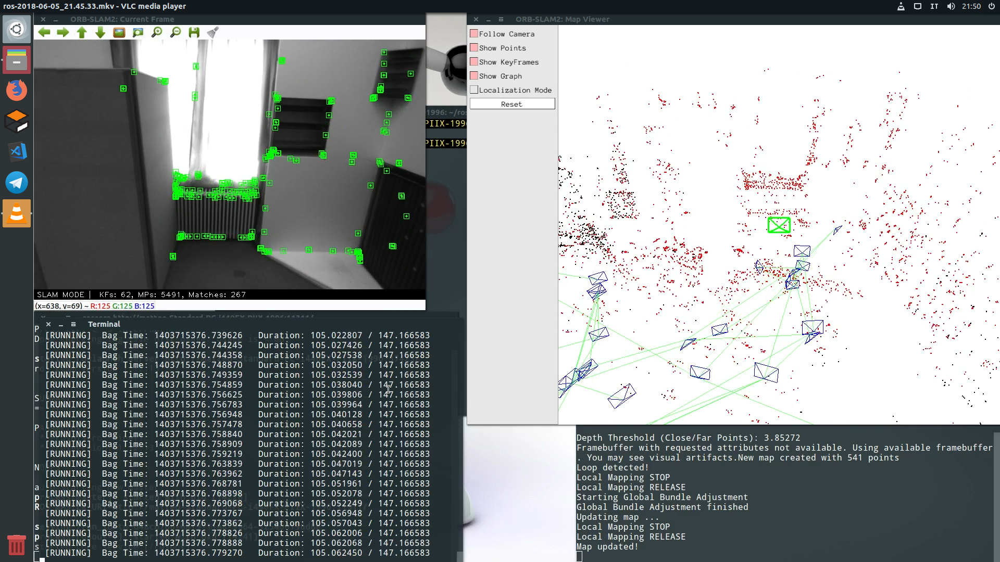
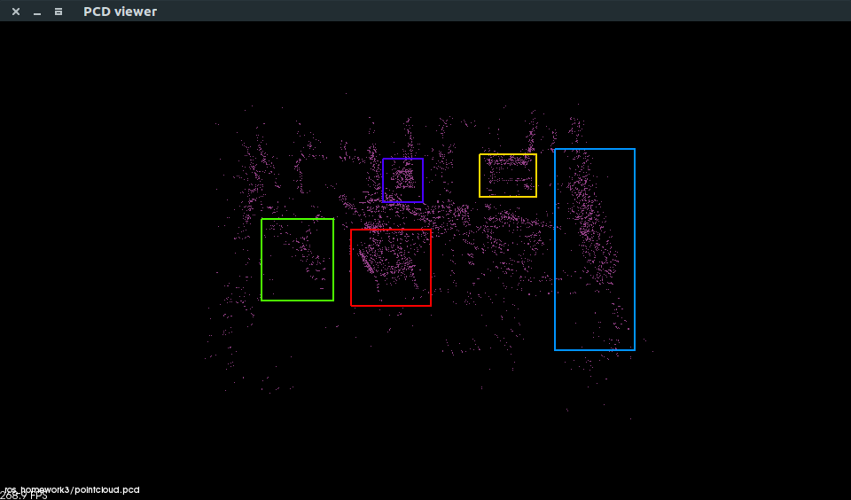
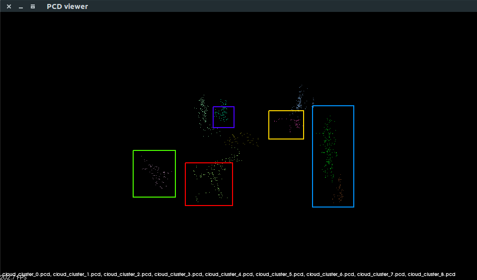
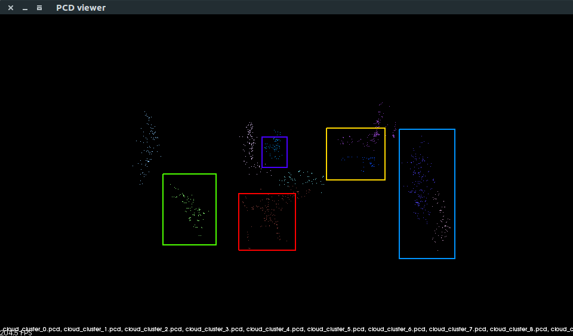

# Univr Cyberphysical Lab course - Homework 3
Third homework assignement of the Cyberphysical Lab course at University of Verona, academic year 2017/2018

The assignment was the following:
> After setting up ORB_SLAM2, modify the source code for allowing .pcl map save, making sure that it's compliant with PCL file specifications.
> Run a test with V1_01_easy.bag rosbag. After that, use the PCL library for viewing the generated point cloud file.
> Clusterize the map.

## Package structure
The `ORB_SLAM2_mod` folder contains a modded version of the original ORB_SLAM2, which allows to save the generated map.
The code was created by Jeroen Zijlmans, you can find the original post [here](https://medium.com/@j.zijlmans/orb-slam-2052515bd84c).
I also commented out two lines in `ORB_SLAM2_mod/src/system.cc` which were causing a deadlock while communicating with `libpangolin`.
The `Cluster` folder contains a little modified version of the clusterizer you can find [here](http://www.pointclouds.org/documentation/tutorials/cluster_extraction.php).

There are three scripts provided:
- **`build.sh`** which automatically builds ORB_SLAM2, the ROS package example and the clusterizer
- **`clean.sh`** (automatically called when launching `build.sh`) which cleans all the files generated by `build.sh`
- **`run.sh`** which spawns three terminals, one with `roscore`, one with the ROS Stereo example and the other one with the `V1_01_easy.bag`.

## How to compile
After making sure you have all the required dependencies (which you can find [here](https://github.com/raulmur/ORB_SLAM2)), simply run `build.sh`.

## How to run
Change the `V1_01_easy.bag` path in `run.sh` according to your path, the run `run.sh`.
When the bag is loaded, press `[SPACE]` in the bag terminal.
If everything goes right, a file named `pointcloud.pcd` is generated.
You can view the pointcloud file using the `pcl_viewer` tool (simply pass the `.pcl` file as an argument).
After that, you can clusterize it using the `cluster_extraction` tool you find in the `build` directory inside `Cluster`.
Simply launch the clusterizer with the file name and the cluster tolerance, like this:
`./cluster_extraction pointcloud.pcd 0.28`.

## Screenshots
ORB_SLAM2 analyzing the room:

The generated point cloud:

Euclidean clustering with `0.26` tolerance value:

Euclidean clustering with `0.28` tolerance value:

---
This file is part of `ros_homework2` and it is distributed under the terms of the GNU General Public License 3

`ros_homework2` is distributed in the hope that it will be useful, but WITHOUT ANY WARRANTY; without even the implied warranty of MERCHANTABILITY or FITNESS FOR A PARTICULAR PURPOSE. See the GNU General Public License 3 for more details.

You should have received a copy of the GNU General Public License along with `ros_homework2`. If not, see http://www.gnu.org/licenses/.
